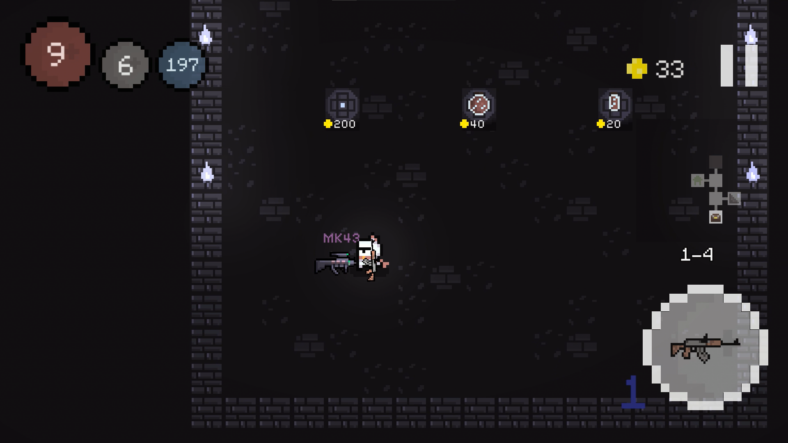

# Pixels & Blood

## Description

PnB is a short, roguelike game developed using Unity. To complete the game, you must navigate through several dungeons, defeating enemies along the way, and ultimately defeat the final boss. Along the way, collect coins to purchase new weapons, potions, and other items to help you on your journey.

I have created this project as a part of my portfolio in order to better demonstrate my skills and knowledge in programming. You are welcome to download it for free and, of course, check out the source code!

**_Have fun!_**

## Content

- [Installation](#installation)
- [Code and features](#features)
- [Screenshots](#screenshots)

## Installation

In order to install the game on Windows visit the [Itch.io](https://dizmoua.itch.io/pixels-blood) page and click the **download** button. Once the installation is complete open **Pixels & Blood.exe** and you're ready to play!

## Code and features

This project is public, so you are welcome to check out the code. Here are some features or scripts that you may find interesting:

- [Creating a dungeon](https://github.com/Dizmo3377/PixelsAndBlood/blob/main/Assets/Script/Level.cs).
- [Base enemy script](https://github.com/Dizmo3377/PixelsAndBlood/blob/main/Assets/Script/Enemies/Enemy.cs).
- [Concrete enemies and boss](https://github.com/Dizmo3377/PixelsAndBlood/tree/main/Assets/Script/Enemies)
- [Weapons](https://github.com/Dizmo3377/PixelsAndBlood/tree/main/Assets/Script/Weapons)
- [Weapon slots (Inventory)](https://github.com/Dizmo3377/PixelsAndBlood/blob/main/Assets/Script/Inventory.cs)
- [Enemy room](https://github.com/Dizmo3377/PixelsAndBlood/blob/main/Assets/Script/EnemyRoom.cs)
- And much more!

## Screenshots

<table>
  <tr>
    <td></td>
    <td></td>
  </tr>
  <tr>
    <td></td>
    <td></td>
  </tr>
</table>

## Thanks!

I really appreciate you taking the time to check the code and play the game! If you have any questions or would like to contact me, please feel free to click on the Telegram button on my [Linktree](https://linktr.ee/DizmoProd).
